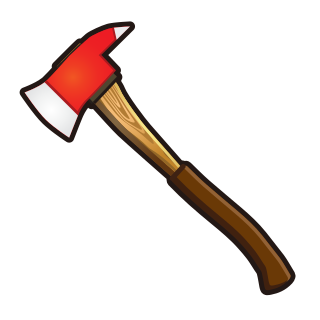

<div align="center">



# HyperAxe

An enchanted [hyperscript](https://github.com/hyperhype/hyperscript) weapon.

[![npm][npm-image]][npm-url]
[![build][build-image]][build-url]
[![downloads][downloads-image]][npm-url]

[npm-image]: https://img.shields.io/npm/v/hyperaxe.svg
[npm-url]: https://www.npmjs.com/package/hyperaxe
[build-image]: https://github.com/ungoldman/hyperaxe/actions/workflows/tests.yml/badge.svg
[build-url]: https://github.com/ungoldman/hyperaxe/actions/workflows/tests.yml
[downloads-image]: https://img.shields.io/npm/dm/hyperaxe.svg

</div>

```sh
npm install hyperaxe
```

```js
import { body, h1 } from 'hyperaxe'

body(
  h1('hello world')
)
// => <body><h1>hello world</h1></body>
```

## Usage

Exports all [HTML tags](https://ghub.io/html-tags).

```js
import { a, img, video } from 'hyperaxe'

a({ href: '#' }, 'click')
// <a href="#">click</a>

img({ src: 'cats.gif', alt: 'lolcats' })
// 

video({ src: 'dogs.mp4', autoplay: true })
// <video src="dogs.mp4" autoplay="true"></video>
```

Default export accepts a tag and returns an element factory.

```js
import h from 'hyperaxe'
const p = h('p')

p('over 9000')
// <p>over 9000</p>
```

CSS shorthand works too.

```js
import h from 'hyperaxe'
const horse = h('.horse.with-hands')

horse('neigh')
// <div class="horse with-hands">neigh</div>
```

Makes creating custom components easy.

```js
import h, { body } from 'hyperaxe'

const siteNav = (...links) => h('nav.site')(
  links.map(link =>
    h('a.link')({ href: link.href }, link.text)
  )
)

body(
  siteNav(
    { href: '#apps', text: 'apps' },
    { href: '#games', text: 'games' }
  )
)
// <body>
//   <nav class="site">
//     <a class="link" href="#apps">apps</a>
//     <a class="link" href="#games">games</a>
//   </nav>
// </body>
```

## Example

Here's a counter increment example, no dependencies required:

```js
import { body, button, h1 } from 'hyperaxe'

let count = 0

function view () {
  return body(
    h1(`count is ${count}`),
    button({ onclick }, 'Increment')
  )
}

function onclick () {
  count++
  render()
}

function render () {
  document.body.replaceWith(view())
}

render()
```

## API

### `hyperaxe`

```js
hyperaxe(tag) => ([props], [...children]) => HTMLElement
```

- `tag` _string_ - valid HTML tag name or CSS shorthand (required)
- `props` _object_ - HTML attributes (optional)
- `children` _node, string, number, array_ - child nodes or primitives (optional)

Returns a function that creates HTML elements.

The factory is [variadic](https://en.wikipedia.org/wiki/Variadic_function), so any number of children are accepted.

```js
h('.variadic')(
  h('h1')('hi'),
  h('h2')('hello'),
  h('h3')('hey'),
  h('h4')('howdy')
)
```

Arrays of children also work.

```js
const kids = [
  h('p')('Once upon a time,'),
  h('p')('there was a variadic function,'),
  h('p')('that also accepted arrays.')
]

h('.arrays')(kids)
```

In a browser context, the object returned by the factory is an [`HTMLElement`](https://developer.mozilla.org/en-US/docs/Web/API/HTMLElement) object. In a server (node) context, the object returned is an instance of [`html-element`](https://github.com/1N50MN14/html-element). In both contexts, the stringified HTML is accessible via the [`outerHTML`](https://developer.mozilla.org/en-US/docs/Web/API/Element/outerHTML) attribute.

### `hyperaxe` named exports

All [HTML tags](https://ghub.io/html-tags) are available as named exports.

They return the same function as described above, with the `tag` argument prefilled.

Think of it as a kind of [partial application](https://en.wikipedia.org/wiki/Partial_application).

The main motivation for doing this is convenience.

```js
import { p } from 'hyperaxe'

p('this is convenient')
```

The one exception is `var`, a reserved word in JavaScript, which is exported as `varTag`.

```js
import { varTag } from 'hyperaxe'

varTag('x')
// <var>x</var>
```

You can pass raw HTML by setting the `innerHTML` property of an element.

```javascript
import { div } from 'hyperaxe'

div({ innerHTML: '<p>Raw HTML!' })
```

### `createFactory(h)`

Creates a `hyperaxe` element factory for a given hyperscript implementation (`h`).

Available as a named export: `import { createFactory } from 'hyperaxe'`

If you use another implementation than `hyperscript` proper, you can exclude that dependency by using `import { createFactory } from 'hyperaxe/factory'`. For the time being, no other implementations are tested though, so wield at your own peril!

### `getFactory(h)`

Same as `createFactory`, except it only creates a new factory on the first call and returns a cached version after that.

Available as a named export: `import { getFactory } from 'hyperaxe'`

## Enchantments

- Summons DOM nodes.
- +1 vs. virtual DOM nodes.
- Grants [Haste](http://engl393-dnd5th.wikia.com/wiki/Haste).

## See Also

This library's approach and API are heavily inspired by [reaxe](https://github.com/jxnblk/reaxe).

## Contributing

Contributors welcome! Please read the [contributing guidelines](CONTRIBUTING.md) before getting started.

## License

[ISC](LICENSE.md)

Axe image is from [emojidex](https://emojidex.com/emoji/axe).
